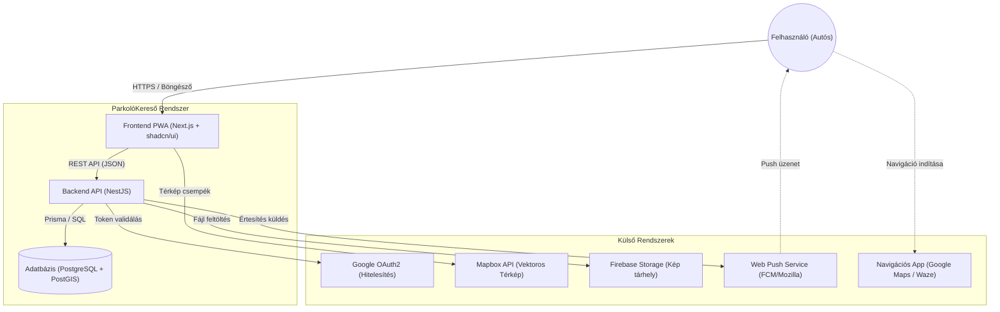

# 1. Bevezetés és Célkitűzés

## 1.1. A probléma felvetése

A modern nagyvárosokban az autós közlekedés egyik legkritikusabb és legstresszesebb pontja a parkolás. A szabad helyek keresése nemcsak jelentős időveszteséget okoz a vezetőknek, de a városi forgalom lassulásához és a károsanyag-kibocsátás növekedéséhez is hozzájárul.

A probléma kettős:

1.  **Információhiány:** Az autósok gyakran nem tudják, hol vannak szabad, ingyenes vagy kedvező árú parkolóhelyek (pl. eldugott utcákban vagy P+R zónákban).
2.  **Adminisztrációs nehézségek:** Gyakori probléma a parkolási idő túllépése, vagy idegen helyen a visszatalálás a leparkolt járműhöz.

A hallgatói feladat egy olyan szoftverrendszer tervezése és megvalósítása volt, amely közösségi összefogással ("crowdsourcing") és modern technológiai megoldásokkal segít enyhíteni ezeken a nehézségeken.

## 1.2. A megoldás: ParkolóKereső Rendszer

A projekt keretében kifejlesztett szoftver egy **térképalapú, online, reszponzív webalkalmazás (PWA)**. A rendszer nem csupán egy statikus térkép, hanem egy aktív parkolási asszisztens, amely a teljes folyamatot támogatja a kereséstől a parkolás lezárásáig.

**A rendszer főbb képességei:**

- **Közösségi adatbázis:** A felhasználók rögzíthetik az általuk felfedezett parkolóhelyeket, megadva azok típusát (pl. Ingyenes, Fizetős, P+R), címét és leírását.
- **Vizuális információ:** A helyszínekről fényképek tölthetők fel, segítve a tájékozódást.
- **Intelligens keresés:** A rendszer támogatja a sugár alapú (radius) keresést a felhasználó GPS pozíciója vagy a térkép középpontja körül.
- **Parkolás menedzsment:** A felhasználó egy gombnyomással rögzítheti parkolása kezdetét ("Itt állok"). A rendszer visszaszámlálót biztosít, és vizuálisan megjeleníti az autó helyét a térképen a visszataláláshoz.
- **Értesítések:** A rendszer push értesítésben figyelmezteti a felhasználót a parkolási idő lejártakor, növelve a kényelmet és elkerülve a büntetéseket.

## 1.3. Rendszerkörnyezet és Kontextus

Az alkalmazás egy elosztott, 3 rétegű architektúrára épül, amely szorosan integrálódik külső, harmadik fél által biztosított szolgáltatásokkal a térképi megjelenítés, a hitelesítés és az adattárolás terén.

Az alábbi kontextus diagram szemlélteti a rendszer kapcsolatait a külvilággal:

