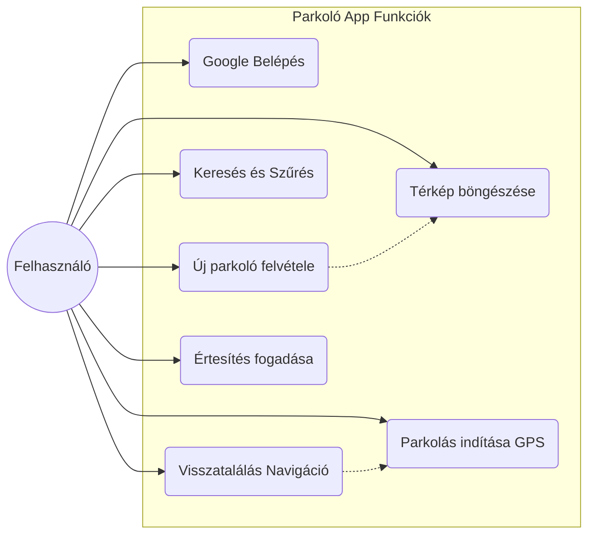

# 2. Követelményspecifikáció

Ez a fejezet a rendszerrel szemben támasztott funkcionális és minőségi követelményeket, valamint a választott technológiai környezetet részletezi.

## 2.1. Funkcionális követelmények

A rendszernek az alábbi felhasználói interakciókat (Use Case) kell támogatnia a megvalósítás során.

### 2.1.1. Felhasználókezelés

- **OAuth2 Belépés:** A felhasználó regisztráció nélkül, meglévő Google-fiókjával léphet be. A rendszer átveszi a felhasználó nevét, email címét és profilképét.
- **Munkamenet kezelés:** A belépés után a rendszer JWT (JSON Web Token) segítségével azonosítja a felhasználót, így oldalfrissítéskor nem szükséges újra bejelentkezni.

### 2.1.2. Parkolóhelyek kezelése

- **Parkoló rögzítése:** A térképen egy jelölő (marker) elhelyezésével új parkoló hozható létre.
  - Kötelező adatok: Név, Cím, Kategória.
  - Kategóriák: Ingyenes, Fizetős, P+R, Parkolóház, Utcai.
- **Képfeltöltés:** A parkolóhoz fénykép csatolható, amelyet a rendszer optimalizálva tárol felhő alapú tárhelyen.
- **Parkolók megjelenítése:** A térképen a parkolók kategóriák szerint, markerekkel jelennek meg. A markerre kattintva információs ablak (Popup) nyílik meg a részletekkel.

### 2.1.3. Keresés és Szűrés

- **Sugár alapú keresés (Radius Search):** A felhasználó egy csúszka (Slider) segítségével állíthatja be a keresési távolságot (pl. 500m - 50km). A rendszer csak a megadott körön belüli találatokat listázza.
- **Szöveges keresés:** Lehetőség van parkoló nevére vagy címére keresni.
- **Kategória szűrés:** A találatok szűkíthetők típus szerint (pl. "Csak Ingyenes").

### 2.1.4. Parkolási folyamat (Session)

- **Parkolás indítása:** A felhasználó a "Leparkoltam itt" gombbal rögzítheti aktuális pozícióját (GPS alapon).
- **Lejárat beállítása:** Opcionálisan megadható a parkolójegy lejárati ideje.
- **Aktív státusz:** A térképen egy állandó panel ("Overlay") mutatja az eltelt időt és a parkolás helyszínét.
- **Visszatalálás:** A rendszer vizuálisan megkülönbözteti a saját autó pozícióját ("Autó" ikon), és gombnyomásra átirányít a telefon alapértelmezett navigációs alkalmazásába (Google Maps / Waze) az útvonaltervezéshez.
- **Értesítések:** Ha a felhasználó beállított lejárati időt, a rendszer szerver oldali időzítővel (Cron) figyeli azt, és lejáratkor Push Notificationt küld a felhasználó eszközére.

### Use Case Diagram

## 2.2. Nem-funkcionális követelmények

A rendszer minőségi jellemzői a modern webes elvárásoknak megfelelően kerültek meghatározásra:

- **Platformfüggetlenség (PWA):** Az alkalmazás böngészőből futtatható, telepítést nem igényel, de mobil eszközökön "Kezdőképernyőhöz adható" (Add to Home Screen), így natív alkalmazásként viselkedik.
- **Reszponzivitás:** A felhasználói felület (`shadcn/ui`, `Tailwind CSS`) automatikusan igazodik a képernyőmérethez. Mobilon alsó navigációs sávot és érintésbarát felületeket, asztali gépen oldalsávot biztosít.
- **Biztonság:**
  - **HTTPS:** A PWA működéséhez (Service Worker, Geolocation) elengedhetetlen a biztonságos csatorna.
  - **Adatvédelem:** A jelszavakat nem a rendszer, hanem a Google kezeli. A backend API csak hitelesített kéréseket szolgál ki.
- **Teljesítmény:** A térképi megjelenítéshez **Mapbox GL JS** (WebGL) technológiát használunk, amely hardveres gyorsítással biztosítja a sima mozgást és nagyítást nagy adatmennyiség esetén is.

## 2.3. Futtatási környezet és Technológiai Stack

A rendszer architektúrájának kiválasztásakor a modularitás, a típusbiztonság és a modern fejlesztői élmény (DX) voltak a fő szempontok.

| Réteg         | Technológia               | Indoklás                                                              |
| :------------ | :------------------------ | :-------------------------------------------------------------------- |
| **Frontend**  | **Next.js 16 (React 19)** | Szerver oldali renderelés (SSR) és modern App Router struktúra.       |
| **Backend**   | **NestJS (Node.js)**      | Strukturált, moduláris keretrendszer, vállalati szintű architektúra.  |
| **Nyelv**     | **TypeScript**            | Szigorú típusosság a teljes stack-en (Full-stack Type Safety).        |
| **Adatbázis** | **PostgreSQL + PostGIS**  | Relációs adatbázis fejlett térinformatikai (geospatial) támogatással. |
| **ORM**       | **Prisma**                | Típusbiztos adatbázis-elérés és migrációkezelés.                      |
| **Validáció** | **Zod**                   | Megosztott validációs sémák a Frontend és Backend között (Monorepo).  |
| **DevOps**    | **Docker & TurboRepo**    | Konténerizált futtatás és hatékony monorepo build rendszer.           |
