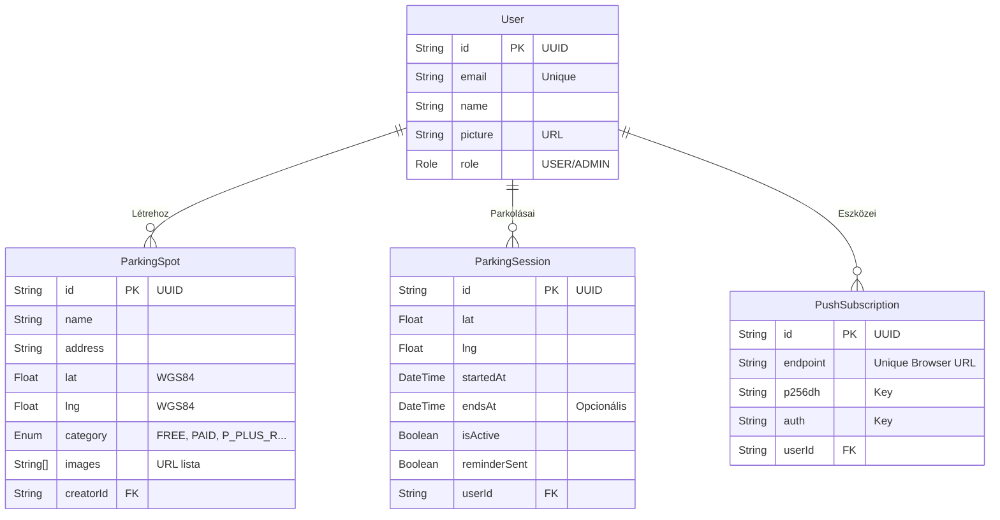
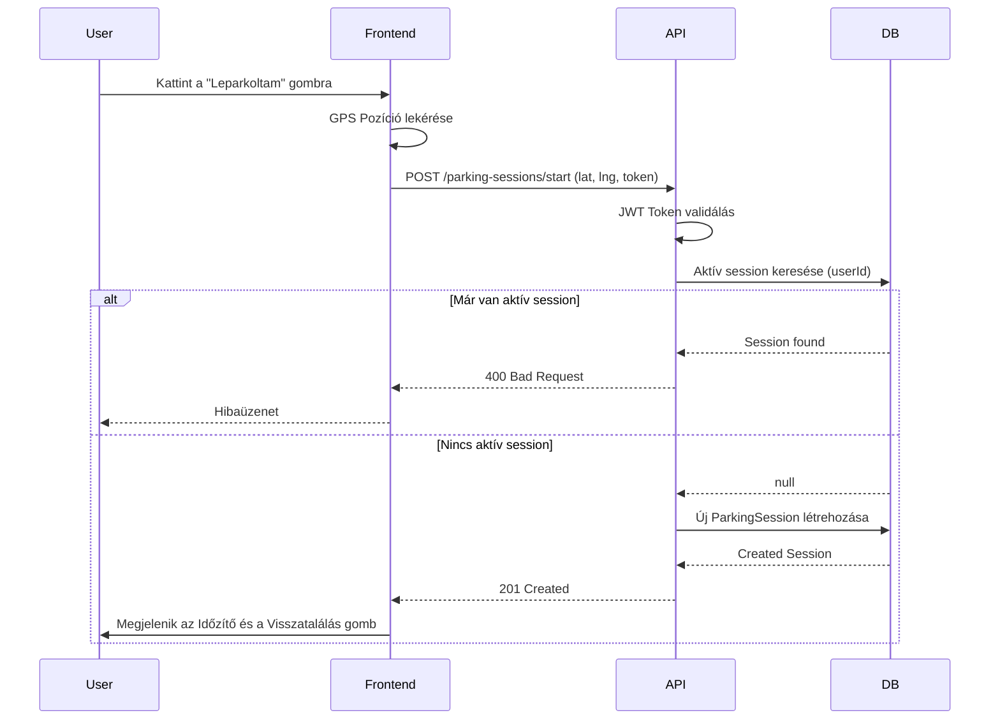

# 3. Rendszerterv és Architektúra

Ez a fejezet a rendszer belső felépítését, az adatbázis szerkezetét és a komponensek közötti kommunikációt mutatja be.

## 3.1. Architekturális áttekintés

A rendszer egy modern, **Monorepo** (TurboRepo) struktúrába szervezett, **3 rétegű (3-tier)** webalkalmazás. A rétegek szigorúan elkülönülnek, kommunikációjuk szabványos interfészeken keresztül történik.

### 3.1.1. Könyvtárszerkezet (Monorepo)

A projekt kódkészlete egyetlen repository-ban található, ami megkönnyíti a verziókezelést és a kódmegosztást.

- **`apps/web` (Frontend):** A Next.js alapú kliens alkalmazás.
- **`apps/api` (Backend):** A NestJS alapú szerver alkalmazás.
- **`packages/schema` (Shared):** A közös Zod validációs sémák és TypeScript típusdefiníciók. Ez biztosítja, hogy a Frontend és Backend közötti adatstruktúrák mindig szinkronban legyenek ("Single Source of Truth").

## 3.2. Adatbázis terv (Adatmodell)

A rendszer adatait egy **PostgreSQL** relációs adatbázisban tároljuk. Az adatbázis-kezelést és a migrációkat a **Prisma ORM** végzi.

Az alábbi ER (Entity-Relationship) diagram mutatja az entitásokat és kapcsolataikat:

### 3.2.1. Geolokációs adatok tárolása

Bár a PostgreSQL `geometry` típusokat is támogat (PostGIS), a Prisma ORM-en keresztül a koordinátákat (`lat`, `lng`) lebegőpontos számként (`Float`) tároljuk a kompatibilitás és a könnyebb kezelhetőség érdekében. A térinformatikai számításokat (távolságkeresés) a backend **nyers SQL (`$queryRaw`)** segítségével, a Haversine-formula végzi.

## 3.3. API Specifikáció

A Backend REST API-t biztosít a Frontend számára. Minden végpont (kivéve a publikus adatok lekérését) JWT tokent vár a `Authorization: Bearer <token>` fejlécben.

### Főbb végpontok csoportosítva:

| Modul        | Metódus | Útvonal                    | Leírás                                                         |
| :----------- | :------ | :------------------------- | :------------------------------------------------------------- |
| **Auth**     | `GET`   | `/auth/google`             | Google OAuth2 folyamat indítása.                               |
| **Auth**     | `GET`   | `/auth/google/callback`    | Google visszatérési pont, JWT generálás.                       |
| **Parkolók** | `POST`  | `/parking-spots`           | Új parkoló létrehozása (Kép URL-ekkel).                        |
| **Parkolók** | `GET`   | `/parking-spots`           | Keresés (Query paraméterek: `lat`, `lng`, `radius`, `search`). |
| **Session**  | `POST`  | `/parking-sessions/start`  | Parkolás indítása.                                             |
| **Session**  | `GET`   | `/parking-sessions/active` | Aktuális aktív parkolás lekérdezése.                           |
| **Session**  | `POST`  | `/parking-sessions/end`    | Parkolás lezárása.                                             |
| **Fájlok**   | `POST`  | `/uploads`                 | Képfeltöltés (Multipart/form-data -> Firebase).                |
| **Push**     | `POST`  | `/notifications/subscribe` | Böngésző feliratkoztatása értesítésekre.                       |

### Szekvencia Diagram: Parkolás Indítása

## 3.4. Háttérfolyamatok és Értesítések

A rendszer nemcsak felhasználói kérésre reagál, hanem önálló háttérfolyamatokat is futtat.

- **Időzítő (Cron Job):** A backendben a `ParkingSchedulerService` percenként lefut.
  1.  Lekérdezi azokat az aktív `ParkingSession`-öket, ahol az `endsAt` (lejárat) időpontja a múltban van ÉS `reminderSent` hamis.
  2.  Ha talál ilyet, meghívja a `NotificationsService`-t.
  3.  A `web-push` könyvtáron keresztül elküldi az értesítést a felhasználó összes regisztrált eszközére.
  4.  Az adatbázisban beállítja a `reminderSent = true` értéket (idempotencia).

## 3.5. Frontend architektúra részletei

A kliens oldal **Next.js App Router**-t használ, amely lehetővé teszi a Szerver (SSR) és Kliens (CSR) komponensek keverését.

- **Állapotkezelés:**
  - **Zustand:** A globális állapotokhoz, mint a bejelentkezett felhasználó tokenje (`useAuthStore`) és a GPS koordináták.
  - **TanStack Query (React Query):** A szerverről érkező adatok (parkolók listája, aktív session) gyorsítótárazására és szinkronizálására. Automatikusan kezeli a "Loading" és "Error" állapotokat.
- **Térkép:** A `react-map-gl` könyvtárat használjuk a Mapbox integrációhoz, amely WebGL alapon, vektorosan rendereli a térképet, támogatva a 3D forgatást és a sötét módot (`next-themes`).
