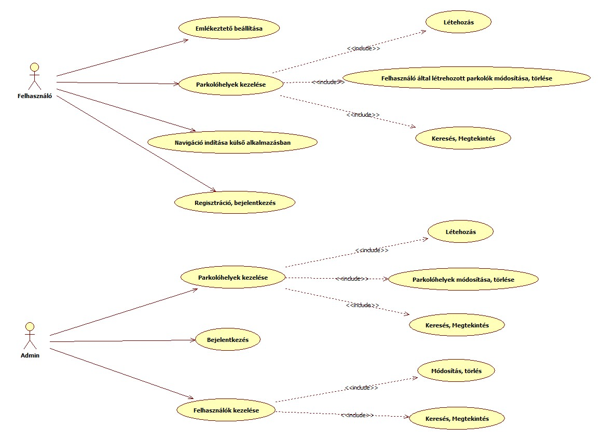

<!-- Spec -->

# Közösségi parkolást segítő portál

## Követelményspecifikáció

**Szoftverarchitektúrák tárgy projektmunka**

---

### Csapattagok

| Név                | Neptun-kód | E-mail cím                  |
| ------------------ | ---------- | --------------------------- |
| Csiszár Alex Gergő | PL4XKM     | csiszaralex@edu.bme.hu      |
| Sinkó Viktor Péter | XCT9YC     | sinkoviktorpeter@gmail.com  |
| Smuk Ferenc        | NRWCFL     | frigyes.smuk@gmail.com      |
| Cseh Bálint István | WRNJPE     | csehbalintistvan@edu.bme.hu |

**Konzulens:** Gazdi László

---

## 1. Feladatkiírás

A hallgatók feladata egy olyan térkép alapú online rendszer kifejlesztése, amelyik lehetővé teszi felhasználóinak, hogy megosszák az általuk ismert ingyenes/előnyös parkolási lehetőségeket a többi felhasználóval. A rendszer legyen elérhető mobil készülékekről.

Az alkalmazás szükséges funkciói:

- fényképek feltöltése a parkolókról,
- a cím alapú keresés,
- a kiválasztott parkolóhoz való navigációt,
- GPS és készülékmozgás alapján ismerje fel, ha valaki leparkolt, és mentse a helyet
- segítsen a leparkolt autóhoz visszatalálni
- legyen lehetőség emlékeztető beállítására a parkolási díj fizetéséhez

A végleges követelmények a konzulenssel egyeztetve alakítandóak ki!

A technológia kiválasztása a hallgatók feladata!

---

## 2. Részletes feladatleírás

### 2.1. Cél

Egy térképalapú, közösségi portál létrehozása, ahol a felhasználók parkolási helyeket oszthatnak meg és kereshetnek.
A rendszer a GPS-adatok alapján felismeri, ha a felhasználó leparkol, elmenti a helyet, és segít később visszatalálni.

### 2.2. A rendszer funkciói

#### Fő funkciók

- **Regisztráció és bejelentkezés** (Google / OAuth2)
- **Parkolóhely hozzáadása**: cím, leírás, kategória és fénykép megadásával
- **Térképes megjelenítés**: az összes felhasználói bejegyzés látható egy interaktív térképen
- **Keresés és szűrés**: cím vagy kategória alapján
- **Navigáció indítása**: a kiválasztott parkolóhoz külső navigációs app megnyitása
- **Automatikus parkolásfelismerés**: GPS és mozgásérzékelés alapján
- **Mentett hely visszakeresése**: az utolsó parkolási hely megjelenítése és útvonalterv
- **Emlékeztető beállítása**: parkolási díj lejáratára push notification

#### Admin funkciók (opcionális)

- Parkolóbejegyzések moderálása, hibás adatok törlése
- Felhasználói fiókok kezelése

---

## 3. Technikai paraméterek

A rendszer **React + Next.js + TypeScript** technológiákra épül, a backend **Node.js (Express)** alapú REST API, az adatok tárolása **PostgreSQL** adatbázisban történik.

| Komponens   | Technológia                | Leírás                                             | Felelős            |
| ----------- | -------------------------- | -------------------------------------------------- | ------------------ |
| Frontend    | React, Next.js, TypeScript | Reszponzív, dinamikus felhasználói felület         | Sinkó Viktor Péter |
| Backend     | Node.js (Express/NestJs)   | REST API, hitelesítés, parkolóhelyek CRUD funkciói | Csiszár Alex Gergő |
| Adatbázis   | PostgreSQL                 | Parkolóhelyek, felhasználók tárolása               | Cseh Bálint István |
| Térkép      | Leaflet.js / Mapbox        | Térképi megjelenítés és geokódolás                 | Cseh Bálint István |
| Hitelesítés | Firebase Auth / OAuth2     | Google-fiókos belépés                              | Smuk Ferenc        |
| Fájlkezelés | Firebase Storage / AWS S3  | Képfeltöltés                                       | Smuk Ferenc        |

        

**Fejlesztési környezet:**

- Git verziókezelés (GitHub repository)
- Postman a backend API-k tesztelésére

**Célplatform:**

- Bármely modern böngésző (Chrome, Firefox)
- Mobil: Android (opcionálisan iOS)

---

## 4. A rendszer által használt fogalmak (Szótár)

| Fogalom                            | Jelentés                                                                                                       |
| ---------------------------------- | -------------------------------------------------------------------------------------------------------------- |
| **Parkolóhely**                    | Egy konkrét földrajzi hely, ahol gépjármű elhelyezhető.                                                        |
| **Felhasználó**                    | Regisztrált személy, aki parkolóhelyeket adhat hozzá és megtekintheti azokat.                                  |
| **Metaadatok**                     | A parkolóhoz tartozó leíró információk (pl. cím, kategória, fénykép).                                          |
| **GPS-helyzet**                    | A felhasználó aktuális földrajzi koordinátái.                                                                  |
| **Automatikus parkolásfelismerés** | A rendszer mozgás és GPS-adatok alapján azonosítja a parkolást.                                                |
| **Push notification**              | Böngésző vagy mobilértesítés a felhasználónak.                                                                 |
| **Kategória**                      | A parkolóhely típus szerinti besorolása (pl. ingyenes, fizetős, P+R, utcai).                                   |
| **Cím**                            | A parkolóhely hivatalos postai címe, amely a kereséshez is használható.                                        |
| **Koordináták**                    | A földrajzi szélesség és hosszúság értékei (WGS84), a hely pontos megadására.                                  |
| **Geokódolás**                     | Cím és koordináták közötti oda-vissza átalakítás folyamata.                                                    |
| **Szűrő**                          | Találatok leszűkítése megadott feltételek (kategória, távolság) alapján.                                       |
| **Navigáció**                      | Útvonalterv indítása külső alkalmazásban a kiválasztott parkolóhoz.                                            |
| **Moderáció**                      | Felhasználói tartalmak ellenőrzése és a szabálytalan bejegyzések kezelése.                                     |
| **Értékelés**                      | Felhasználói visszajelzés a parkolóhelyről (pl. csillagok, szöveges vélemény).                                 |
| **Hozzászólás**                    | Szöveges megjegyzés egy parkolóhely bejegyzéséhez.                                                             |
| **Időkorlát**                      | Parkolási időre vonatkozó korlátozás (pl. max. 2 óra).                                                         |
| **Díjszabás**                      | A parkolási díj típusa és mértéke (időalapú, zónás, napszakhoz kötött).                                        |
| **Távolságszűrő**                  | Találatok szűrése a felhasználó aktuális pozíciójától mért távolság alapján.                                   |
| **Térképi megjelenítés**           | Az alkalmazásban látható interaktív térkép, amely a parkolóhelyeket jeleníti meg.                              |
| **CRUD műveletek**                 | Az adatok kezelése: Create (létrehozás), Read (lekérdezés), Update (módosítás), Delete (törlés).               |
| **OAuth2 / Google Auth**           | Nyílt hitelesítési szabvány, amely lehetővé teszi harmadik fél (pl. Google) segítségével való bejelentkezést.  |
| **Backend**                        | A szerveroldali logika, amely feldolgozza a felhasználói kéréseket és kezeli az adatokat.                      |
| **Frontend**                       | A felhasználó által látható és vezérelhető grafikus felület.                                                   |
| **REST API**                       | A kliens és a szerver közötti adatátvitelt biztosító szabványos interfész.                                     |
| **Adatbázis-rekord**               | Egy adott parkolóhelyhez vagy felhasználóhoz tartozó bejegyzés az adatbázisban.                                |
| **Navigáció**                      | Külső térképalkalmazás (pl. Google Maps) megnyitása a kiválasztott célpontra.                                  |
| **Reszponzív felület**             | Olyan felhasználói felület, amely különböző képernyőméreteken (pl. mobilon, asztali gépen) is jól használható. |
| **Emlékeztető**                    | A parkolási idő lejáratára figyelmeztető funkció, amely push üzenetet küld.                                    |
| **Kategória**                      | A parkolóhely típusa vagy jellemzője (pl. ingyenes, fizetős, fedett, P+R).                                     |
| **Képfeltöltés**                   | A felhasználó által készített fénykép elmentése a parkolóhelyhez.                                              |
| **Token**                          | A felhasználó hitelesítéséhez használt digitális azonosító.                                                    |
| **Reszponzív dizájn**              | A megjelenés automatikus igazítása a képernyő méretéhez és orientációjához.                                    |
| **Marker**                         | A térképen megjelenő jelölő ikon, amely a parkolóhely helyét mutatja.                                          |

---

        

## 5. Esszenciális use-case-ek

### 5.1. Use-case diagram

